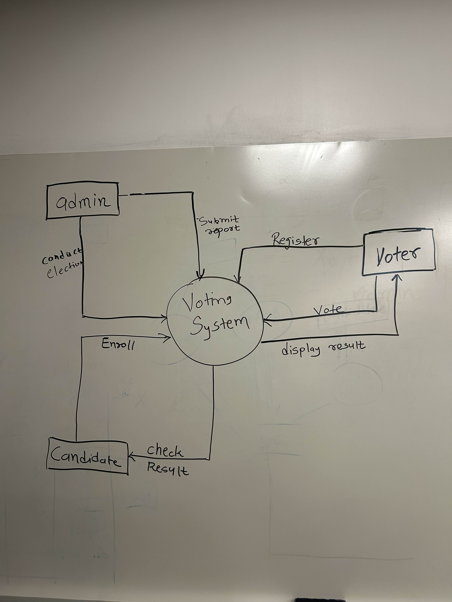

# Meeting Minutes (10-07)

## Administrivia
The scribe is the person taking the _notes_. This is encouraged to be a single person to reduce problems.
* Time: 11:00-12:10
* Location: Fawcett 204
* Scribe: Prashant Rai

## Agenda
* System Design
  * System workflow on what are main features of    user, admin and candidates
  * Project design diagrams selection finalization.

## Notes
* All members discussed about choosing two types of diagrams for design sepecification. and while also talking more about roles that should be given or restricted to different type of users of the system.

## Action Items
* Wireframe was finalized and Flowchart/UML diagram was selected from all the other diagrams to be choosed for the system
* Feature restrictions on users and candidates were made more clearer

## Meeting images

## Signatures
Prashant Rai  
Michael Donahue  
Divyesh Ambaliya  
Sachin Patel  
Dhruv Patel  