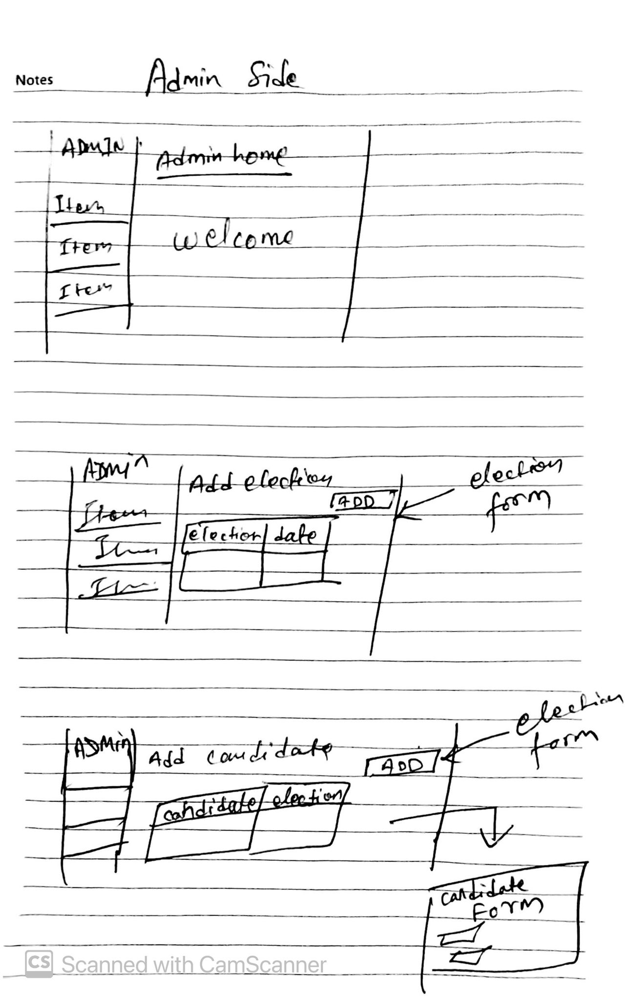

# Meeting Minutes (10-13)

## Administrivia
The scribe is the person taking the _notes_. This is encouraged to be a single person to reduce problems.
* Time: 3:00-3:40(PM)
* Location: Virtual
* Scribe: Prashant Rai

## Agenda
* Admin System Design
    * Discussion over admin side of the UI designs.

## Notes
* All members discussed about admin-side of the system. Talked more about wireframes design for the admin-side. Pages, buttons and everything to make the user-experience user-friendly were discussed.

## Action Items
* Wireframes of admin-side of the system was designed and discussed in the notes.

## Meeting images

## Signatures
Prashant Rai  
Michael Donahue  
Divyesh Ambaliya  
Dhruv Patel  
Sachin Patel
