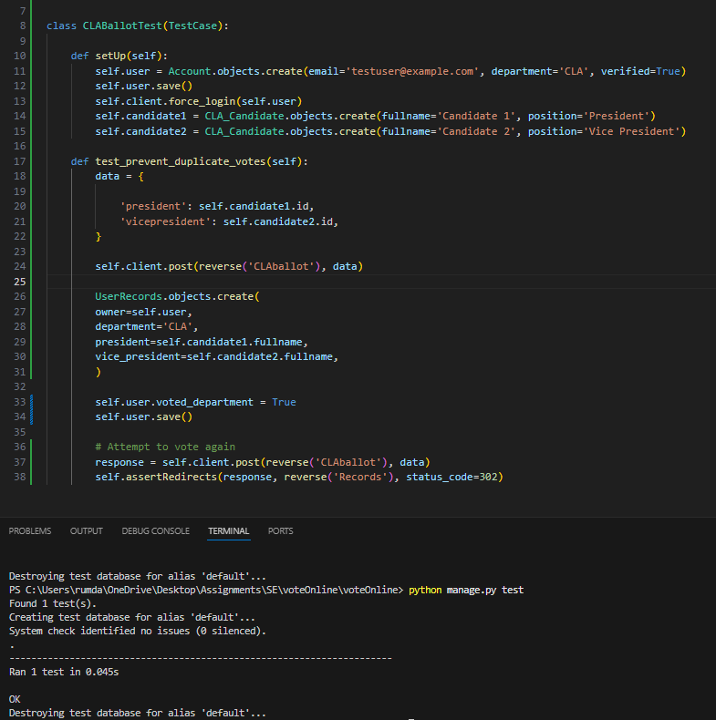
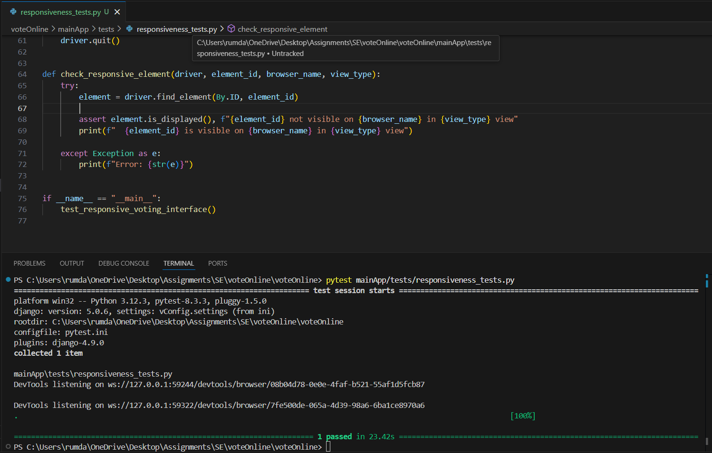
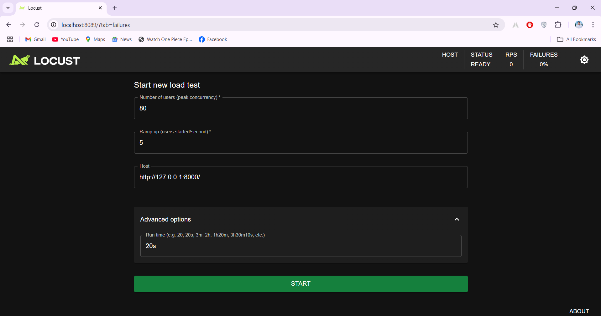
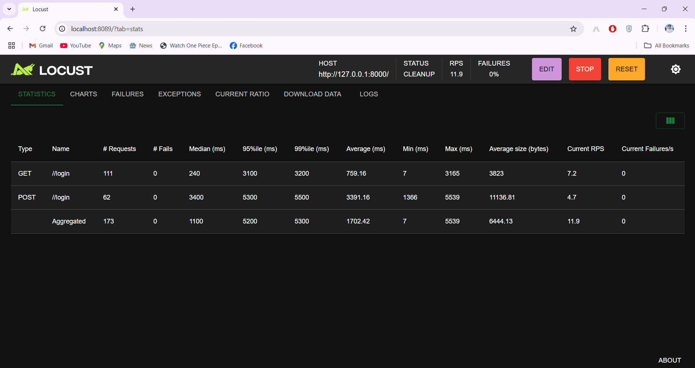
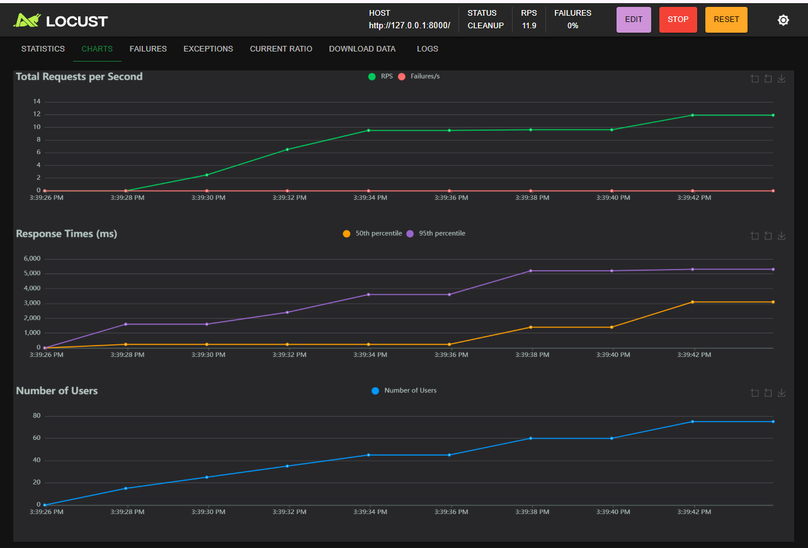
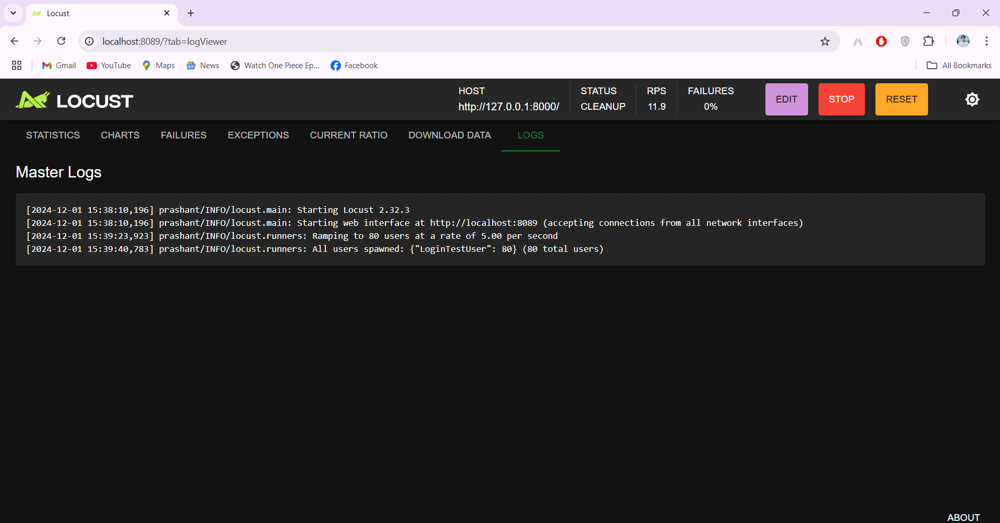

# Testing 11.1

### Testing Plan
The testing plan focuses on unit testing to verify that the CLA department ballot system correctly prevents duplicate votes. The test will check that when a user attempts to submit multiple votes for the same department (after already casting a vote), the system will redirect them to the Records page instead of allowing a second vote. The primary focus is ensuring that the logic preventing duplicate votes is functioning as expected at the unit level.

### Testing Framework

This unit test case utilizes Django's built-in testing framework (django.test). Django's framework provides a robust and convenient way to write unit tests for any django project.

### Justification:
1) Choice of Plan:

    This testing plan fits well within the team's software development plan by focusing on the core functionality of preventing duplicate votes. Unit testing allows us to isolate this specific feature and verify its correctness independently, ensuring a solid foundation before integrating it with other parts of the system.

2) Choice of Framework:

    * Achievability: Django's built-in testing framework is readily available and well-integrated with the Django application structure, making it easily achievable for our team.

    * Adequacy: This framework provides the necessary tools to effectively test the desired functionality. By using Django's testing client, we can simulate user interactions, including submitting votes, and assert the expected outcomes, such as redirects or error messages.

### Test case: Preventing duplicate users from voting
   

# Testing 12.1/12.2

### Testing Plan
The plan involves functional testing to verify the responsiveness of the voting interface across different browsers and devices. The primary focus will be on testing key UI elements like the main container, navigation bar, and footer, ensuring that they are properly displayed on desktop, tablet, and mobile devices.

### Testing Framework
We will use Selenium WebDriver for automated testing. Selenium is ideal for this task as it supports cross-browser testing, allowing us to run tests on Chrome, Firefox, and Edge. It also facilitates simulating different screen sizes to validate the responsive layout of the interface.

### Justification:
This testing approach is appropriate because it aligns with the need to ensure cross-browser compatibility and responsive design across a range of devices. Selenium was chosen for its robustness and wide support for different browsers, making it feasible to automate the testing process across multiple platforms. The scope of the testing is well-defined, focusing on the visibility and layout of critical UI components, which are key aspects of functional testing. This method ensures that the application performs as expected in various environments, covering the essential functionality of the system.

### Test case: Responsiveness in different browers(Chrome/Edge/FireFox) for different devices(Windows/Tablet/Mobile)
   

# Testing 13.1/13.2

### Testing Plan
The testing will focus on load testing and functional testing of the login and registration features. We will use Locust to simulate 80 concurrent users performing login operations. The main goals are to evaluate:
* Performance under load by simulating multiple users.
* Success and failure rates for user login attempts.
* Response times for the login and registration processes.

### Testing Framework
We will use Locust, a powerful load-testing tool that supports simulating multiple users and tracking response times and failure rates. Locust is ideal for our needs due to:

* Achievability: It integrates easily with Django and is simple to set up.
* Effectiveness: It provides real-time statistics like success/failure rates and response times, which are key for performance testing.

### Justification:
This test plan aligns with the Agile SDLC as it provides quick feedback on system performance under load, which is essential for continuous integration. Locust allows us to quickly assess whether the system can handle concurrent users and maintain performance, ensuring scalability. And for this test, we applied upto 80 users to hit request and these users increases by every 5 seconds and access the login url.

### Test case: 
1) **Locust - Start test**  
* We can see that 111 users are requesting login just for browsing purpose.
* 62 users are actually logging in and try to get autherized.
* Each user can visit the url multiple times thats why the requests are more than 80 even though users were only set upto 80.
* We see no failure and 80 users could interact with login url 173 times in 2seconds.  
 
   

2) **Locust Result - Statics**  
 
   

3) **Locust Result - Charts**  
 
   

3) **Locust Result - Logs**  
 
   