# Design Specification

## Requirement: User stories

**Requirement 1.1**   
A User's vote shall be cast to a database where all votes are pooled
* Vote Database
  * A model created for the votes to be stored
  * User votes from the voting form of the desired election
  * the vote is stored in the database where model of the votes is created.
* Flowchart Designs:    
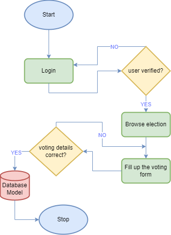

* Sequence Designs:    
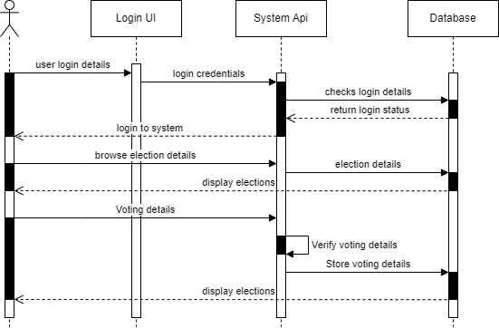

**Requirement 1.2**  
The system shall provide a secure interface for students to cast their votes.
* Cast your vote
  * Navigate to election voting ballot
  * Browse for your favorite candidate for desired post
  * Select the candidate by clicking the *radio button* infront of each candidate
  * After Selecting, press *vote button* at the bottom of the page

* Wireframe Designs:    
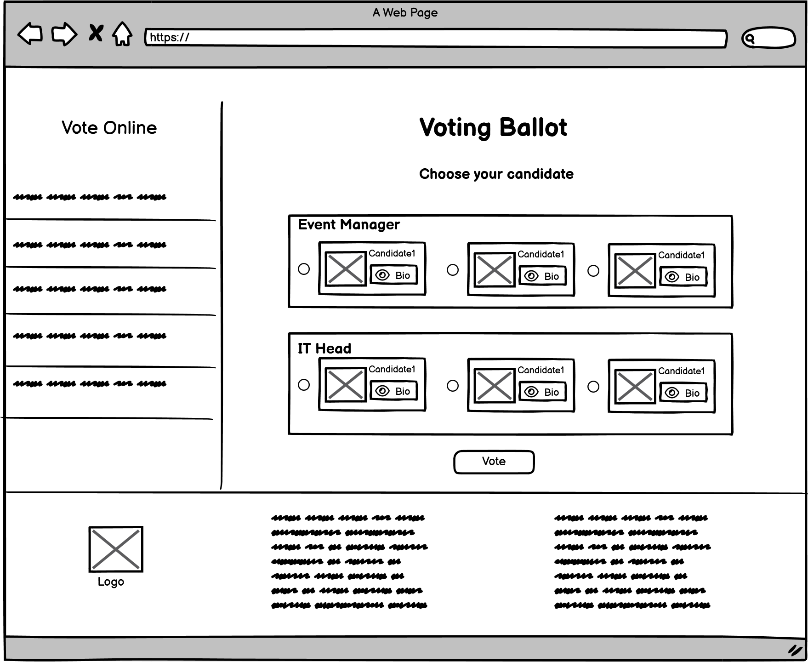

* Flowchart Designs:    

**Requirement 2.1**   
A confirmation message shall be displayed immediately after vote submission.
* Vote
  * Select candidate
  * Press Vote button
  * A confirmation pop-up dialog box is displayed

* Wireframe Designs:    
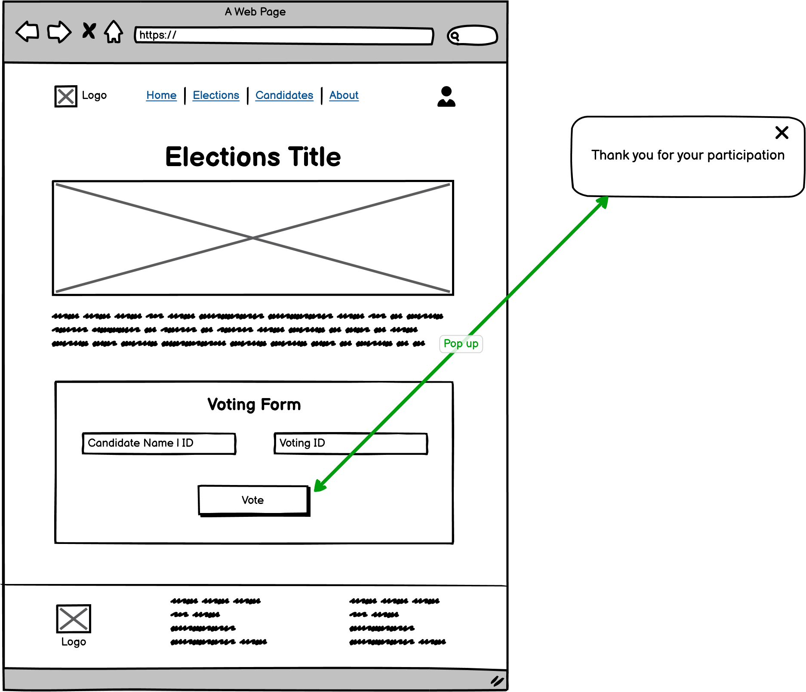

* Flowchart Designs:    

**Requirement 2.2**  
The system shall send an email to the voter once the vote has been succesfully recorded.
* Vote
  * Select desired candidate
  * Press Vote button
  * A confirmation email is sent

* Wireframe Designs:    

* Flowchart Designs:    
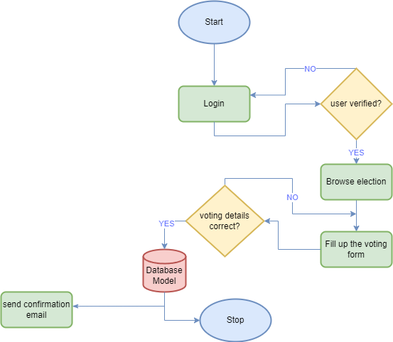

**Requirement 3.1**   
The User interface shall include register and login form.
* Registration of student
  * After entering all the student's credentials, 
  * Press the register button
* Login into the system  
  * Enter email and password in student login form
  * Press login button
* Wireframe Designs:    
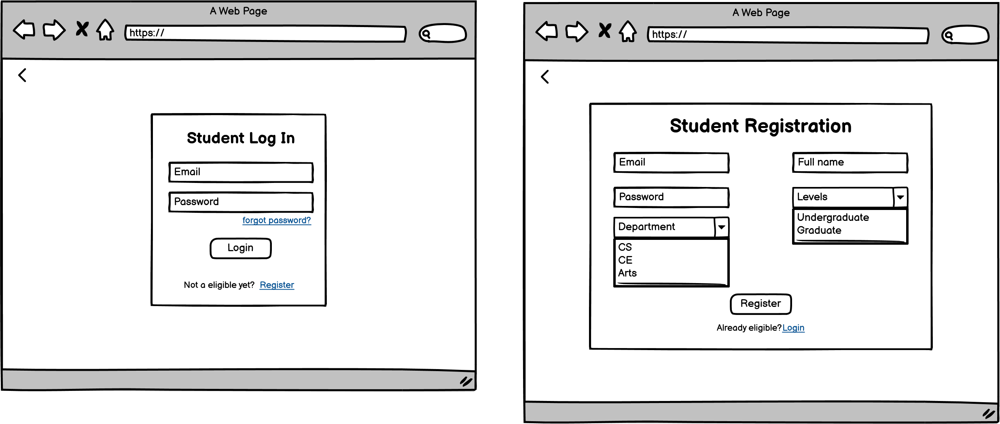

* Sequence Designs:    
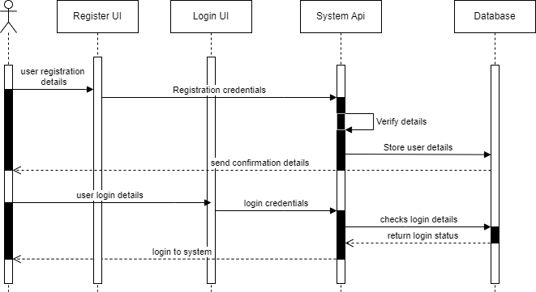

**Requirement 3.2**  
The User's credentials shall be validated with the database to ensure security.
* Logining
  * Enter user credentials
  * Press login button
  * credentials is checked
  * Invalid credentials displays error message
* Wireframe Designs:    
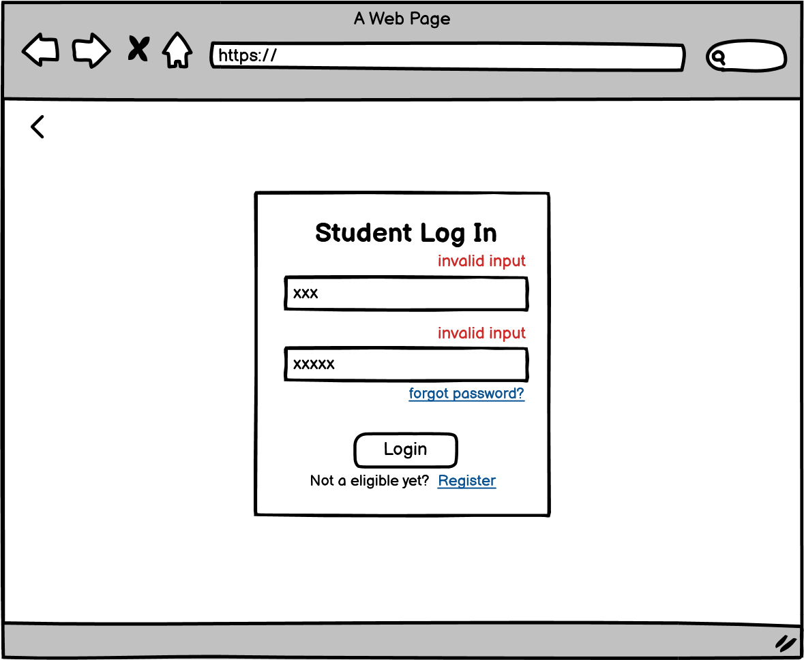

* Sequence Designs:    
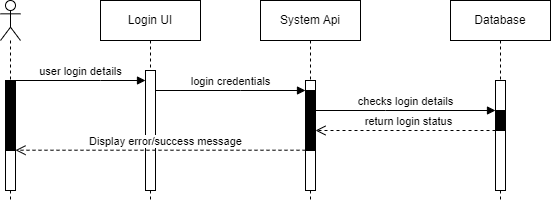

**Requirement 4.1**   
The system shall provide an administrative interface for managing election.
* Login to Admin side
  * Navigate to Elections page
  * Click on *Add Election* button to add new election
  * Browse through the table of elections that are added in the system
  * Manage the elecitons by editing or deleting it
* Wireframe Designs:    
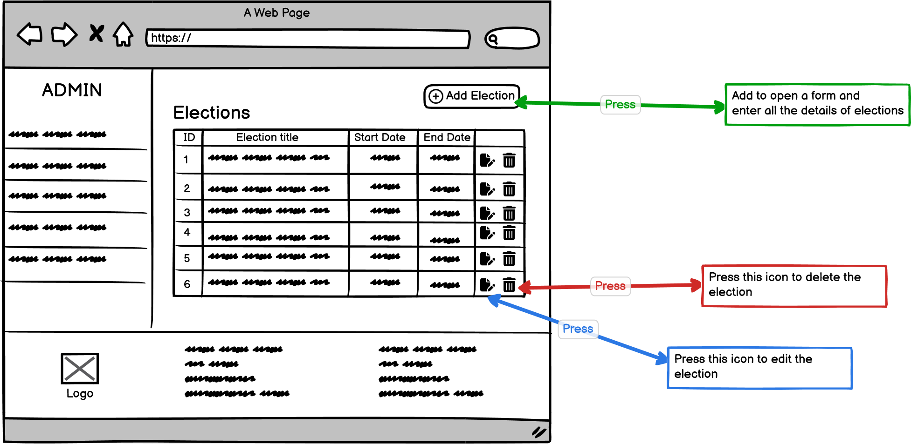

* Flowchart Designs:    
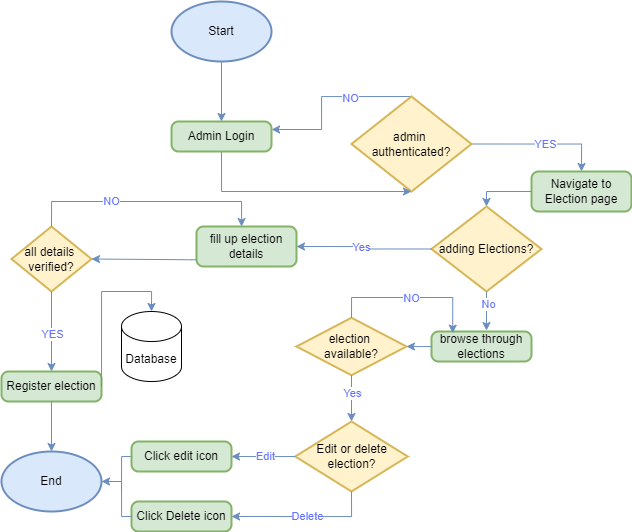

**Requirement 4.2**  
Administrators shall be able to add and remove candidates from the election.
* Adding candidates
  * Navigate to candidate addition section in admin-side
  * Select a desired elections from the drop-down options of all the registered elections
  * Select a candidate from the drop-down options of all the registered user that will be assigned as candidate
  * Press add button to add the candidate to that particular selected election

* Editing and Deleting candidates
  * Navigate to candidates in admin-side
  * Browse through all the candidates in their respective elections listed in the table
  * Press the icon with blue pointed arrow to edit the candidate
  * Press the icon with red pointed arrow to delete the candidate

* Wireframe Designs:    
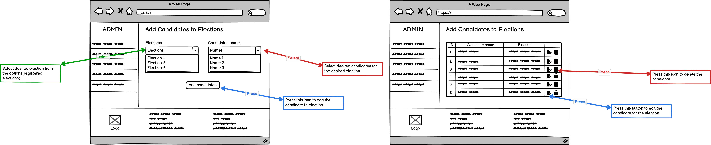

* Flowchart Designs:    
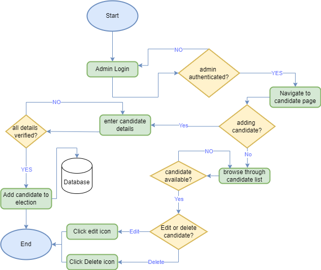

**Requirement 5.1**   
Student shall have access to all the details about the election and election details
* Browse elections
  * Navigate to elections page
  * Browse through elections
  * Press the *view details* button of the desired election
  * Details of the selected election is displayed in a new page
* Wireframe Designs:    
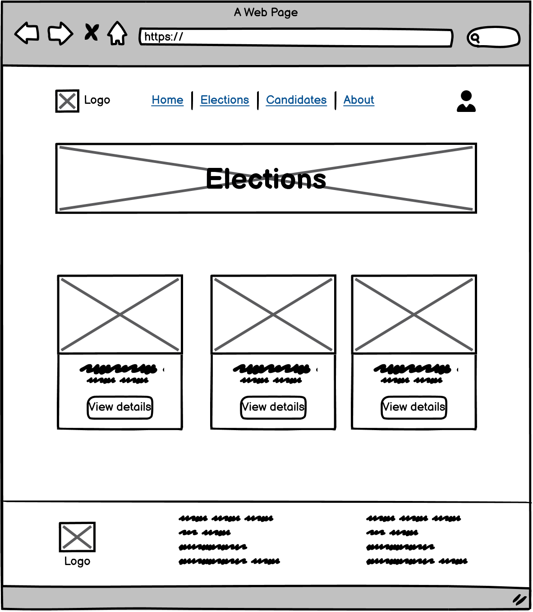

* Flowchart Designs:    
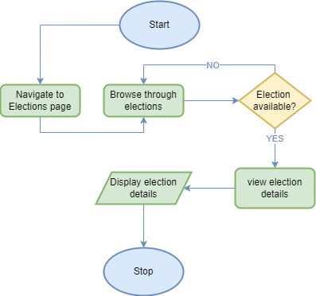

**Requirement 5.2**  
The user interface shall provide an option to view descriptions of each candidate.
* Browse candidates
  * Navigate to candidates page
  * Browse through candidates
  * Press anywhere on the conatiner box of desired candidate
  * Details of the selected candidate is displayed in a new page
* Wireframe Designs:    
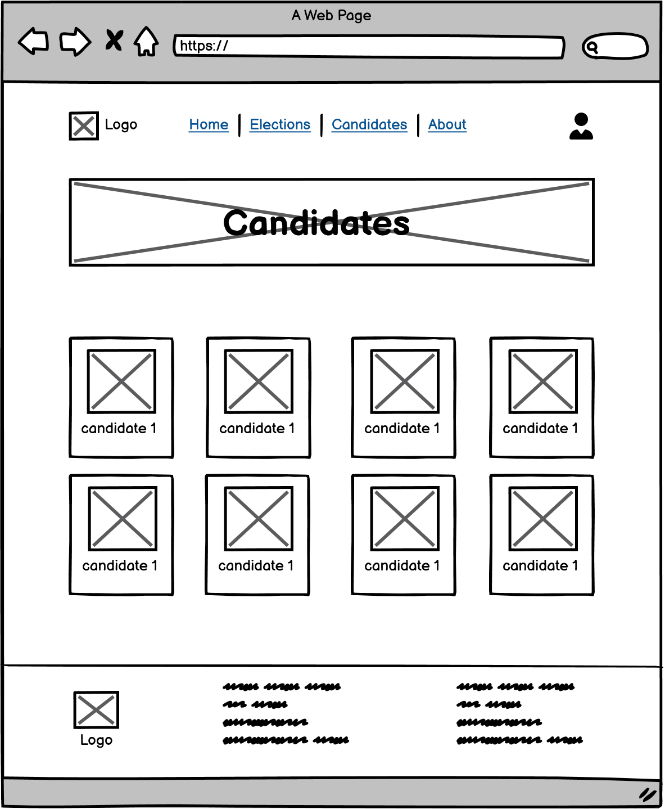

* Flowchart Designs:    
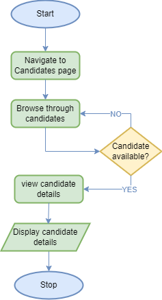

## Requirement: Developer stories

**Requirement 6.1**   
The system shall implement secure API endpoints for communication between the frontend and the database.
* Web app communicates with API 
* API communicates with backend & database
* database communicates with backend and API

**Requirement 7.1**   
The system shall ensure data integrity and security during data transmission.
* Usernames and passwords will be verified
  * Database will be queried to verify existing student
  

**Requirement 8.1**   
The system shall define a database structure that efficiently handles voter data, candidate profiles, and election results.
* 
  * Design Statement
* Design Statement

**Requirement 8.2**   
The system shall implement indexing and optimization techniques for quick data retrieval.
* Design Statement
  * Design Statement
* Design Statement

**Requirement 9.1**   
The system shall provide a user-friendly interface for students to browse candidates and cast their votes.
* Design Statement
  * Design Statement
* Design Statement

**Requirement 9.2**   
The interface must be tested for responsiveness on various devices.
* Device responsiveness in different browser
  * Open different type of browers like chrome, microsoft edge, brave etc
  * Run the site on all the browers
  * All the UI/UX should be same

**Requirement 10.1**   
The system shall ensure the voting experience is simple, accessible, and mobile-friendly.
* Mobile responsiveness
  * Use a mobile i.e. both andriod and ios
  * Open the site on multiple browser on both device
  * UI might differ than window version but functionality should be unchanged

**Requirement 10.2**   
User feedback shall be collected to improve the voting interface.
* Send Feedback (does not need login)
  * Scroll till the bottom of the homepage
  * Fill up the feedback form with user's name, email and feedback message
  * Press *send* button to submit the form

* Wireframe design:  
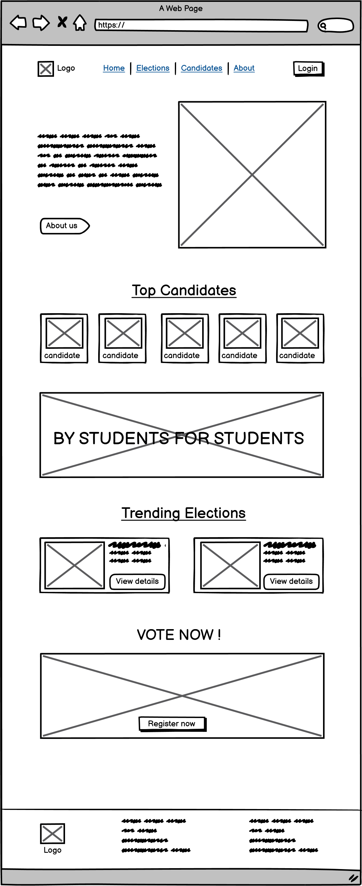

* Flowchart Designs:    
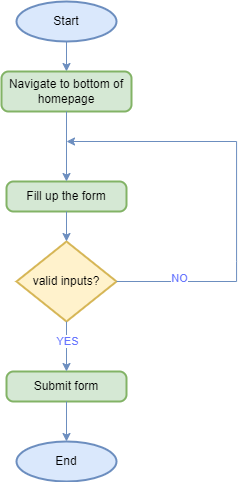

## Requirement: Testing

**Requirement 11.1**   
The system shall be tested to prevent duplicate votes by attempting multiple submissions from a single user.
* Eradicate Duplication
  * Vote using voting form
  * System compares if the user has already voted for that election or not by comparing user id.
  * Vote completes if not present else throws error

**Requirement 12.1**   
The system shall be tested on multiple device types (mobile, tablet, desktop) and screen resolutions to verify that the voting interface is responsive and maintains usability.
* Each feature of the UI will be tested across various screen sizes to ensure consistent functionality and visibility.

**Requirement 12.2**   
Adjustments shall be made based on identified issues to enhance the responsiveness and usability of the interface.
* Issues will be documented and prioritized, then addressed by the development team with re-testing to validate fixes.

**Requirement 13.1**   
The system shall be tested under high user loads to confirm its ability to handle multiple concurrent users.
* System durability
  * Stress test using linux to be able to send increasingly higher queries to ensure system stability

**Requirement 13.2**   
Performance benchmarks shall be established for system responsiveness.
* Benchmark tests 
  * Open website on multiple different browsers
  * Test opening website on different devices to test responsiveness 
