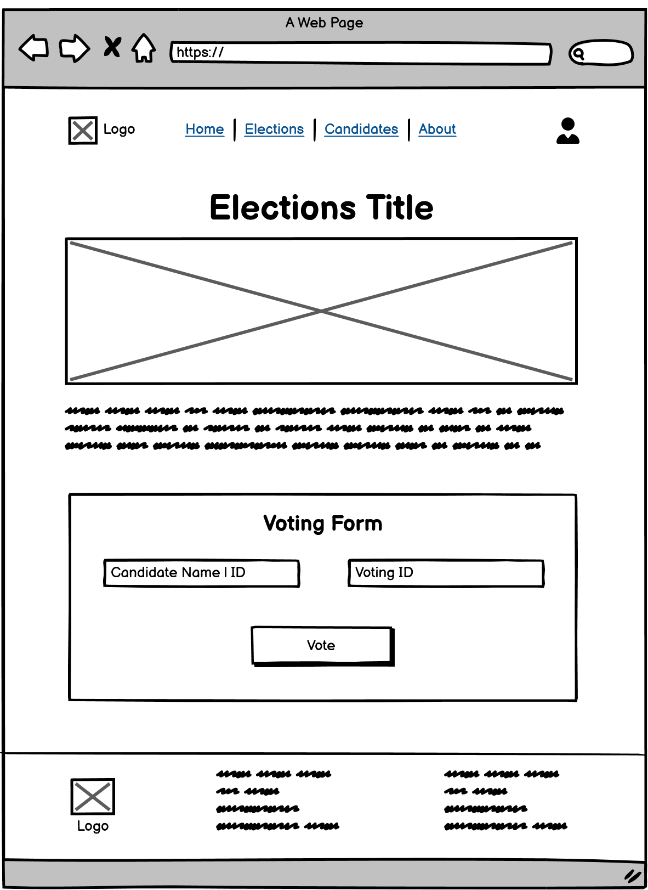
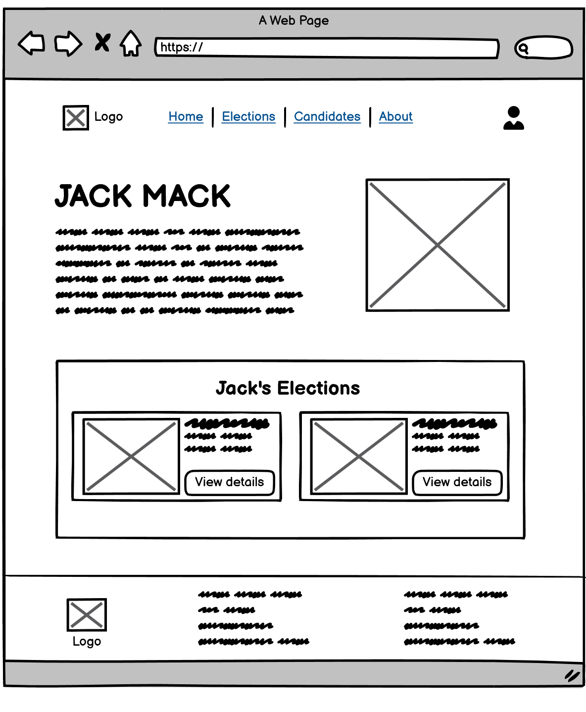

# Design Specification

## Requirement: User stories

**Requirement 1.1**   
A User's vote shall be cast to a database where all votes are pooled
* Design Statement
  * Design Statement
* Design Statement

**Requirement 1.2**  
The system shall provide a secure interface for students to cast their votes.
* Design Statement
  * Design Statement

**Requirement 1.3**  
The system shall ensure that all votes are encrypted before being stored.
* Design Statement
  * Design Statement

**Requirement 2.1**   
A confirmation message shall be displayed immediately after vote submission.
* Vote
  * Enter desired candidate's credentials
  * Press Vote button
  * A confirmation pop-up dialog box is displayed

* Designs:    

**Requirement 2.2**  
The system shall send an email to the voter once the vote has been succesfully recorded.
* Vote
  * Enter desired candidate's credentials
  * Press Vote button
  * A confirmation email is sent

* Designs:    

**Requirement 3.1**   
The User interface shall include register and login form.
* Registration of student
  * After entering all the student's credentials, 
  * Press the register button
* Login into the system  
  * Enter email and password in student login form
  * Press login button
* Designs:    

**Requirement 3.2**  
The User's credentials shall be validated with the database to ensure security.
* Logining
  * Enter user credentials
  * Press login button
  * credentials is checked
  * Invalid credentials displays error message
* Designs:    

**Requirement 4.1**   
The system shall provide an administrative interface for managing election.
* Login to Admin side
  * Navigate to Elections page
  * Click on *Add Election* button to add new election
  * Browse through the table of elections that are added in the system
  * Manage the elecitons by editing or deleting it
* Designs:    

**Requirement 4.2**  
Administrators shall be able to add and remove candidates from the election.
* Design Statement
  * Design Statement

**Requirement 5.1**   
Student shall have access to all the details about the election and election details
* Browse elections
  * Navigate to elections page
  * Browse through elections
  * Press the *view details* button of the desired election
  * Details of the selected election is displayed in a new page
* Designs:    

**Requirement 5.2**  
The user interface shall provide an option to view descriptions of each candidate.
* Browse candidates
  * Navigate to candidates page
  * Browse through candidates
  * Press anywhere on the conatiner box of desired candidate
  * Details of the selected candidate is displayed in a new page
* Designs:    

## Requirement: Developer stories

**Requirement 6.1**   
The system shall implement secure API endpoints for communication between the frontend and the database.
* Design Statement
  * Design Statement
* Design Statement

**Requirement 7.1**   
The system shall ensure data integrity and security during data transmission.
* Design Statement
  * Design Statement
* Design Statement

**Requirement 8.1**   
The system shall define a database structure that efficiently handles voter data, candidate profiles, and election results.
* Design Statement
  * Design Statement
* Design Statement

**Requirement 8.2**   
The system shall implement indexing and optimization techniques for quick data retrieval.
* Design Statement
  * Design Statement
* Design Statement

**Requirement 9.1**   
The system shall provide a user-friendly interface for students to browse candidates and cast their votes.
* Design Statement
  * Design Statement
* Design Statement

**Requirement 9.2**   
The interface must be tested for responsiveness on various devices.
* Design Statement
  * Design Statement
* Design Statement

**Requirement 10.1**   
The system shall ensure the voting experience is simple, accessible, and mobile-friendly.
* Design Statement
  * Design Statement
* Design Statement

**Requirement 10.2**   
User feedback shall be collected to improve the voting interface.
* Design Statement
  * Design Statement
* Design Statement

## Requirement: Testing

**Requirement 11.1**   
The system shall be tested to prevent duplicate votes by attempting multiple submissions from a single user.
* Design Statement
  * Design Statement
* Design Statement

**Requirement 11.2**   
The system must undergo penetration testing to identify vulnerabilities.
* Design Statement
  * Design Statement
* Design Statement

**Requirement 12.1**   
The system shall conduct usability testing sessions with students to gather feedback on the voting interface.
* Design Statement
  * Design Statement
* Design Statement

**Requirement 12.2**   
Adjustments shall be made based on user feedback to enhance usability.
* Design Statement
  * Design Statement
* Design Statement

**Requirement 13.1**   
The system shall be tested under high user loads to confirm its ability to handle multiple concurrent users.
* Design Statement
  * Design Statement
* Design Statement

**Requirement 13.2**   
Performance benchmarks shall be established for system responsiveness.
* Design Statement
  * Design Statement
* Design Statement
