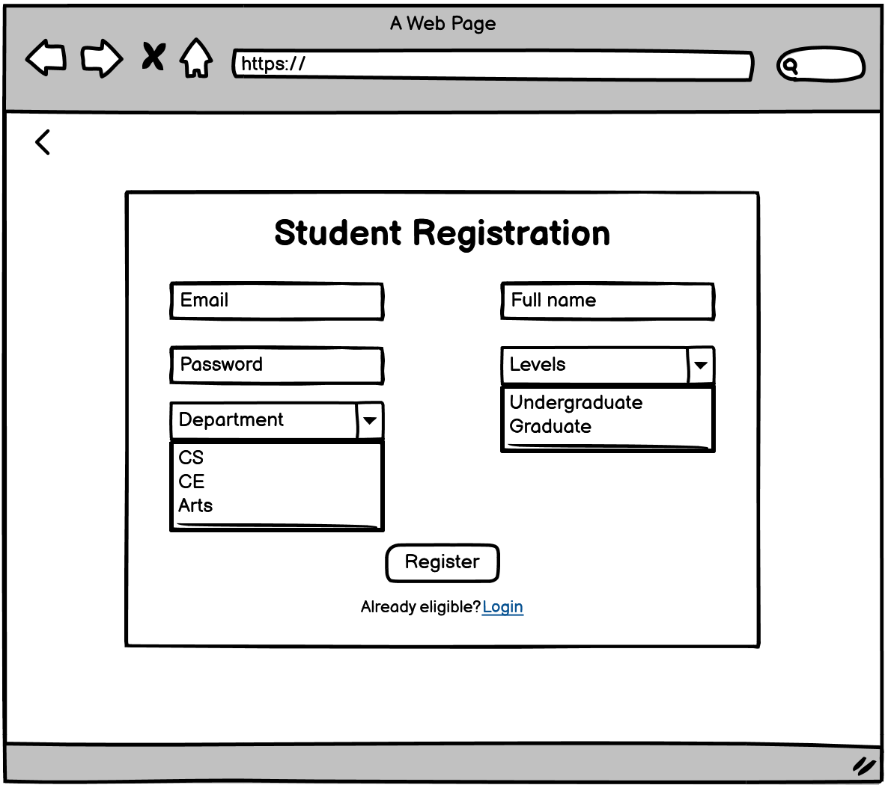
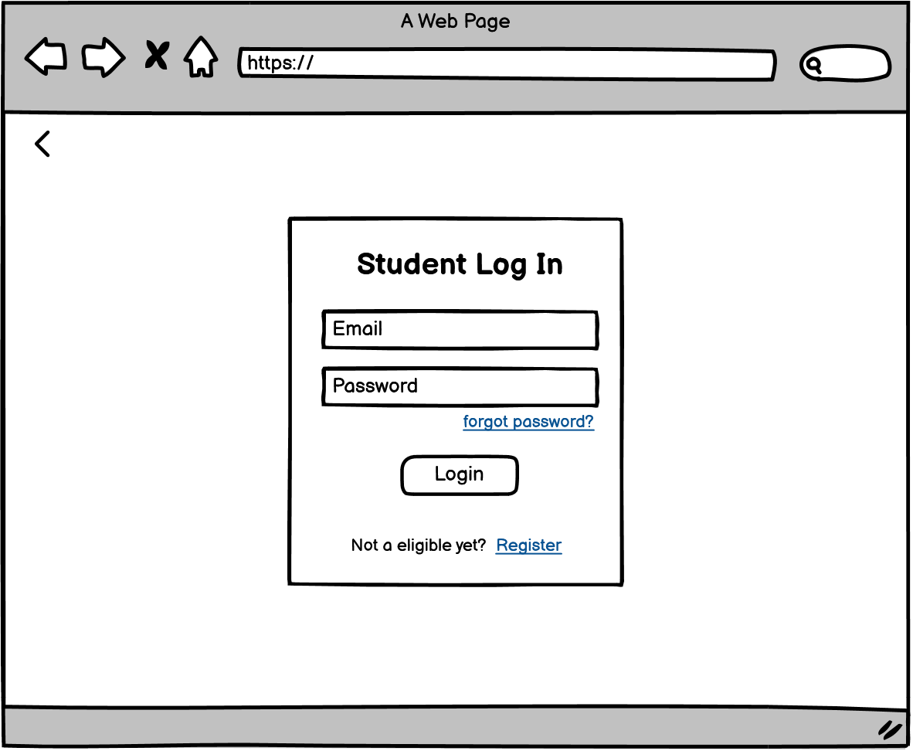

# Design Specification

## Requirement: User stories

**Requirement 1.1**   
A User's vote shall be cast to a database where all votes are pooled
* Design Statement
  * Design Statement
* Design Statement

**Requirement 1.2**  
_Requirement text_
* Design Statement
  * Design Statement

**Requirement 2.1**   
The system shall send an email to the voter once the vote has been succesfully recorded.
* Design Statement
  * Design Statement
* Design Statement

**Requirement 2.2**  
_Requirement text_
* Design Statement
  * Design Statement

**Requirement 3.1**   
The User interface shall include register form.
* Design Statement
  * Design Statement
* Design Statement
* Designs:  

**Requirement 3.2**  
The User interface shall include login form.
* Design Statement
  * Design Statement

* Designs:  

**Requirement 4.1**   
Administrators shall have access to the list of canidates, along with access to edit that list.
* Design Statement
  * Design Statement
* Design Statement

**Requirement 4.2**  
_Requirement text_
* Design Statement
  * Design Statement

**Requirement 5.1**   
Student shall have access to all the details about the election and candidates.
* Design Statement
  * Design Statement
* Design Statement

**Requirement 5.2**  
_Requirement text_
* Design Statement
  * Design Statement

## Requirement: Developer stories

**Requirement 1.1**   
A User's vote shall be cast to a database where all votes are pooled
* Design Statement
  * Design Statement
* Design Statement

**Requirement 1.2**  
_Requirement text_
* Design Statement
  * Design Statement

## Requirement: Testing

**Requirement 1.1**   
A User's vote shall be cast to a database where all votes are pooled
* Design Statement
  * Design Statement
* Design Statement

**Requirement 1.2**  
_Requirement text_
* Design Statement
  * Design Statement

