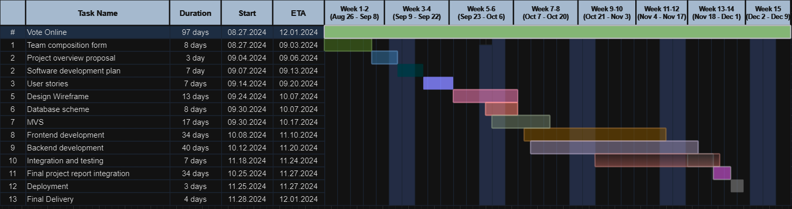

# Software Development Plan  

## Communication Plan 

**Meeting Locations:**
We primarily hold meetings in the Fawcett Hall classroom, and the library's Help Desk lounge, and also use Discord for virtual discussions.

**Meeting Time(s):**
We meet every Tuesday and Thursday after 5 PM for 30 minutes, and if necessary, we connect virtually through Discord.

**Meeting Cadence:** 
At least two days per week

**Communication mechanism:**
We use Discord for virtual discussions, while important updates or information are conveyed via email, text, or call. Responses are expected within a day.

## Timelines

**Gantt Chart**

**MVS:**
21st September to 17th October 2024

**Requirement Specification:**
initial draft submission: 24th September to 17th October 2024

**Design Specification:**
Initial draft submission: 30th September to 17th October 2024

**Milestones**
- Front-End Development: 
    Voter authentication, candidate viewing, ballot design, and voting submission.
    Framework: HTML, CSS and Javascript for building an interactive, responsive interface.

- Back-End Development:
	Admin dashboard for creating elections, managing candidates, and monitoring votes.
	Secure vote counting, real-time results, and voter eligibility verification.
	Framework: Python Django framwork for managing user data, security, and interactions with the database.

- Database Development:
	Database scheme (PostgreSQL or SQLlite for relational data management)
	Program wireframe

- Deployment:
	Deploy the system on cloud servers and perform final checks.
	Integration and testing

- Final delivery:
	Release the final version of product and perform final presentation.

## CP(Critical Path):

The critical path was designed based on the sequential steps essential to 
the completion of the online voting system project. We've ensured that 
tasks related to core system functionality, such as user authentication, 
ballot creation, and voting tally mechanisms, are prioritized first. These 
components are critical since any delay in their completion would directly 
affect subsequent tasks, like user interface adjustments and system 
security enhancements. Given our team's consistent workflow and effective 
collaboration, we're confident in adhering to this path with minimal risk 
of delays.

## PM(Project Management):

For project management, we employed a risk-averse approach, taking into 
account possible delays or challenges with resource availability and team 
member workloads. The project timelines were built to accommodate 
flexibility, allowing us to adapt if certain tasks take longer than 
anticipated. By frequently reviewing progress through team check-ins and 
refining our Gantt chart as needed, we aim to maintain focus on key 
deliverables while ensuring that the team can address unforeseen issues 
without affecting overall project deadlines.

## Change of Dates

| Task                               |From Dates           | To Dates            | Reason                                               | 
| -----------------------------------|---------------------|---------------------|------------------------------------------------------|
| Requirement specification          |09-23-2024/09-24-2024|09-24-2024/10-17-2024|To proceed according to class schedule.               |
| Wireframe Design	 			     |09-25-2024/10-02-2024|09-30-2024/10-17-2024|rescheduled following req. specification date.        |
| Database scheme design             |09-25-2024/10-02-2024|09-30-2024/10-17-2024|rescheduled following req. specification date.        |
| FrontEnd Development               |09-28-2024/11-10-2024|10-08-2024/11-10-2024|rescheduled following design specification date.      |
| BackeEnd Development				 |09-28-2024/11-17-2024|10-12-2024/11-20-2024|rescheduled to start it only after 4 days of frontend |development.
| Final report						 |10-19-2024/11-26-2024|10-25-2024/12-27-2024|rescheduled accordingly with the other changed dates  |
