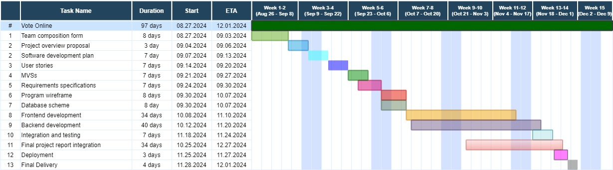

# Software Development Plan  

## Communication Plan 

**Meeting Locations:**
We primarily hold meetings in the Fawcett Hall classroom, and the library's Help Desk lounge, and also use Discord for virtual discussions.

**Meeting Time(s):**
We meet every Tuesday and Thursday after 5 PM for 30 minutes, and if necessary, we connect virtually through Discord.

**Meeting Cadence:** 
At least two days per week

**Communication mechanism:**
We use Discord for virtual discussions, while important updates or information are conveyed via email, text, or call. Responses are expected within a day.

## Timelines

**Gantt Chart**

**MVS:**
21st September to 27th September 2024

**Requirement Specification:**
23rd September to 24th September 2024

** Design Specification:**
25th September to 2nd October 2024

**Milestones**
Front-End Development: 
    Voter authentication, candidate viewing, ballot design, and voting submission.
    Framework: React.js for building an interactive, responsive interface.

Back-End Development:
	Admin dashboard for creating elections, managing candidates, and monitoring votes.
	Secure vote counting, real-time results, and voter eligibility verification.
	Framework: Django or Node.js for managing user data, security, and interactions with the database.

Database Development:
	Database scheme (PostgreSQL or MySQL for relational data management)
	Program wireframe

Deployment:
	Deploy the system on cloud servers and perform final checks.
	Integration and testing

Final delivery:
	Release the final version of product and perform final presentation.
